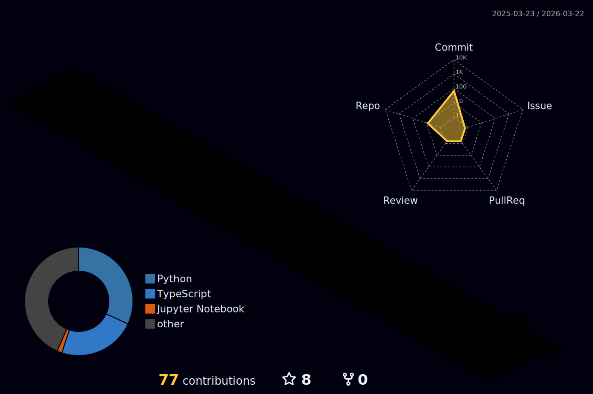

<div align="center">


[](https://git.io/typing-svg)

<br><br>

<table>
<tr>
<td align="center" width="100%">

**🎵 Currently Vibing To**

[](https://open.spotify.com/user/31xxki75krzap4jb66r6objqsvki)

</td>
</tr>
</table>

</div>


<h2 align="center">🧠 About Me</h2>

<table align="center">
<tr>
<td width="50%" valign="top">

#### 🎯 Current Focus

```yaml
Role: Data Science Graduate Student
Specialization: AI & ML Engineering
Institution: Kristu Jayanti College
Status: Building Intelligent Systems
```

#### 🔬 Research Interests
- 🤖 Deep Learning Architectures
- 🧩 Retrieval-Augmented Generation
- 📊 Scalable Data Analytics
- 🚀 Production ML Deployment

</td>
<td width="50%" valign="top">


#### ⚡ Quick Facts

```python
def deimonmi():
    passions = ["AI", "ML", "Real-World Impact"]
    current = "M.Sc. Data Science"
    focus = ["CNN", "RAG", "LangChain", "LLaMA"]
    return "Transforming data into insights 📈"
```

</td>
</tr>
</table>

<br clear="right"/>


<h2 align="center">🚀 Featured Projects</h2>

<div align="center">

<table>
<tr>
<td width="50%" valign="top">

### 🧠 [Nexus – AI Study Assistant](https://github.com/deimon999)

  

```diff
+ RAG-Powered Study Companion
+ LangChain & LLaMA Integration
+ Productivity Suite (Notes, Tasks, Pomodoro)
+ Enhanced Learning Efficiency
```

**Tech Stack:** `LangChain` `LLaMA` `RAG` `Flask` `Pinecone`

</td>
<td width="50%" valign="top">

### 🎭 [Deepfake Detection System](https://github.com/deimon999)

  

```diff
+ Deep Learning Classifier
+ CNN & EfficientNet Architecture
+ MTCNN Face Extraction Pipeline
+ High Precision Detection
```

**Tech Stack:** `TensorFlow` `CNN` `EfficientNet` `OpenCV` `MTCNN`

</td>
</tr>
<tr>
<td width="50%" valign="top">

### ✈️ [Flight Fare Prediction](https://github.com/deimon999)

  

```diff
+ End-to-End ML Web Application
+ Random Forest & XGBoost Models
+ Low RMSE Achievement
+ Feature Engineering & Tuning
```

**Tech Stack:** `Scikit-learn` `XGBoost` `Random Forest` `Flask`

</td>
<td width="50%" valign="top">

### 📊 More Coming Soon...


```yaml
Status: Building Amazing Things
Focus: AI/ML Innovation
Goal: Real-World Impact
```

**Star** ⭐ my repos if you find them interesting!

</td>
</tr>
</table>

</div>

<h2 align="center">💼 Impact in Action</h2>

<div align="center">

<table>
<tr>
<td align="center" width="33%">


### 📊 Data Analysis

**4,922**  
Villages Analyzed

<sub>Power BI Dashboards</sub>

</td>
<td align="center" width="33%">


### 🛣️ Impact Delivered

**258**  
Roadless Villages

<sub>Identified for Development</sub>

</td>
<td align="center" width="33%">


### 🏢 Organization

**MTPS**  
State-Level Planning

<sub>Infrastructure Insights</sub>

</td>
</tr>
</table>

<br>

<details>
<summary>🔍 <b>View Impact Details</b></summary>
<br>

**Position:** Data Analyst Intern (Hybrid)  
**Organization:** Meghalaya Technology Parks Society  
**Duration:** Jun 2025 – Jul 2025

**Key Achievements:**
- ✅ Architected Power BI dashboards analyzing 4,922 unconnected villages
- ✅ Optimized data pipelines using Excel and Power Query
- ✅ Identified 258 roadless villages as development priorities
- ✅ Provided actionable insights for state infrastructure planning
- ✅ Cleaned and merged complex government datasets

**Technologies Used:** `Power BI` `Excel` `Power Query` `Data Pipelines` `Government Data`

</details>

</div>


### 🛠️ Tech Stack

<div align="center">


**Specialized Skills**  
`LangChain` `RAG` `LLaMA` `Ollama` `EfficientNet` `CNN` `XGBoost` `Pinecone`

</div>

<br>

<div align="center">

### 💻 Skill Level Visualization


</div>


<h2 align="center">💭 Dev Quote of the Day</h2>

<div align="center">


</div>


<h2 align="center">🏆 Achievements & Trophies</h2>

<div align="center">


<br><br>

[](https://holopin.io/@deimon999)

</div>


<h2 align="center">📊 GitHub Analytics Dashboard</h2>

<div align="center">

<table>
<tr>
<td width="50%" align="center">


</td>
<td width="50%" align="center">


</td>
</tr>
<tr>
<td colspan="2" align="center">


</td>
</tr>
</table>

</div>


<h2 align="center">⏱️ Coding Activity & Contributions</h2>

<div align="center">

<table>
<tr>
<td align="center">

**WakaTime Coding Stats**

[](https://wakatime.com/@deimon999)

</td>
</tr>
<tr>
<td align="center">

**Contribution Activity Graph**

[](https://github.com/ashutosh00710/github-readme-activity-graph)

</td>
</tr>
</table>

</div>


<h2 align="center">🐍 Contribution Snake Game</h2>

<div align="center">


</div>


<h2 align="center">🎮 3D Contribution Calendar</h2>

<div align="center">



</div>


<h2 align="center">🤝 Connect With Me</h2>

<div align="center">

[](https://linkedin.com/in/deimonmi-kyndiah)
[](mailto:kyndiahdeimon753@gmail.com)
[](https://github.com/deimon999)

</div>


<div align="center">
  
*Open to AI/ML roles and research collaborations*


</div>


